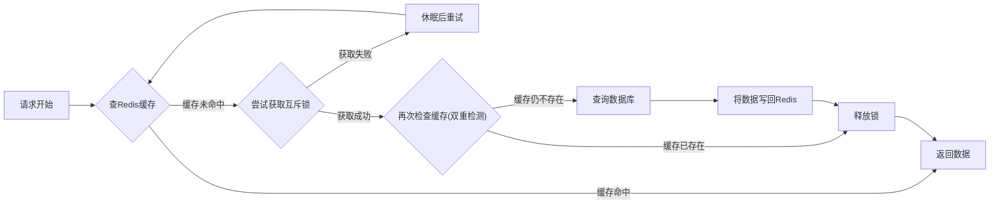
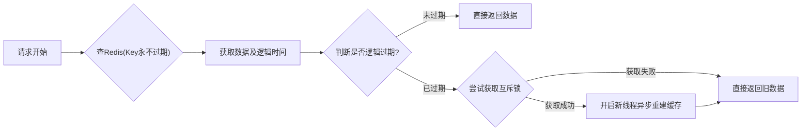

# 1 基础

## 1.1 redis 为什么这么快（高）

  首先，redis全都是操作内存的，并且是单线程的，省去了切换线程之类的开销。最后就是，虽然是单线程，但是允许一个线程同时监控多个io流，不会单独等待一个请求

## 1.2 redis高性能怎么实现的

性能一般基于两个方面：计算操作和读写操作

- 计算操作：因为是基于内存的，所以计算很快，然后单线程执行命令比较快，所以redis瓶颈不在计算，而在于网络IO
	- 单线程快是因为不需要加锁，锁很耗资源。不需要切换上下文
- 读写操作：无非就是磁盘io和网络io
	- 磁盘io：rdb持久化时，创建一个子进程来生成RDB文件，这可以避免主进程（单线程）的阻塞
	- 网络io：
		- io多路复用：可以同时监听多个socket连接请求
		- 事件派发机制：有很多不同性质的socket，redis有不同的handler来处理，redis使用多线程来处理

## 1.3 Redis 常用的数据结构有哪些？以及最常用的使用场景（高）
1. String：最常规的set/get，value可以是String也可以是数字，一般做复杂的计数功能的缓存。
2. Hash：Value存结构化的对象，比较方便操作其中某个字段
3. List：
	- 支持两端存取
	- 使用List的数据结构可以做简单的消息队列功能，也可以使用`lrange`来实现Redis分页
4. Set：全局去重，因为不允许重复值存入。以及交集、并集、差集等
5. Sorted set：其中元素可以按照Score排序，做排行榜，取Top(n)
6. geo：地理位置计算
7. bitmap：布隆过滤器
8. HyperLogLog：统计页面UV
9. Stream：做简单的消息队列

## 1.4 string 底层结构（中）
- 是一个结构体，包含len、free、value属性
- SDS动态字符串
## 1.5 Zset 底层的数据结构？（中）
- 压缩列表+跳表
	- 若有序集合元素小于128，并且每个元素的值小于64B时，会使用压缩列表
	- 不满足上述条件，就使用跳表

## 1.6 介绍一下跳表（中）
- 本质是一个多层有序链表，可以快速定位数据
- 0-----------------8
- 0--------4--------8
- 0-1-2-3-4-5-6-7-8-9

## 1.7 本地缓存和 Redis 缓存的区别，优缺点？（低）

## 1.8 redis 的常见应用场景 / 你平时会用 redis 做什么（中）
- 缓存：将热点数据存在内存中，可以极大提高访问速度，减轻数据库压力
- 排行榜：有序集合结构非常适合用于实现排行榜和排名系统，方便进行排序
- 分布式锁：确保多个进程或服务之间的数据操作的原子性和一致性

# 2 redis 常见场景题

## 2.1 如何实现排行榜？（中）
- 使用sorted set。比如王者荣耀排行榜，以rank为key，当前段位或者别的为score，存入zset，段位升了就使用zadd添加score

## 2.2 实现简单的抽奖系统怎么做？（中）
- 首先使用sadd k1 v1 v2 v3
- spop key count（`spop k1 2`）：随机移除并获取指定集合中一个或多个元素，适合不允许重复中奖的场景
- srandmember key count：随机获取一个，适合允许重复中奖的场景

## 2.3 统计活跃用户怎么做？（中）
- 使用位图  bitmap

## 2.4 统计页面 UV （Unique Visitors  不重复访客量）怎么做（中）
- 使用HyperLogLog
- `pfadd uv1 user1 user2 user3 user1`
- `pfcount uv1 `
- 合并一个月的：`pfmrege uv1 uv2 uv3`

## 2.5 实现在线用户列表怎么做 (按登录时间排序、可查询、踢人)（中）
- zset 登录时间戳作为score 排序就很简单了
- 会话过期怎么做：
	- score是登录时间戳，那只要score小于当前时间-会话有效时间，就删除

1. 支持多端登录
	- <mark style="background: #BBFABBA6;">实现</mark>
		1. <mark style="background: #FFB86CA6;">在线名单</mark>，`online_users`(zset，因为既能存用户，又能按照登录时间排序)
			- key：online_users
			- score：登录时间
			- value：userID
		2. <mark style="background: #FFB86CA6;">用户资料</mark>，普通String就行了
			- key：user_cache:user:123(用userID区分)
			- value：用户详细资料
	- <mark style="background: #D2B3FFA6;">查询</mark>
		- 先去online_users看有没有这个成员，然后再去user_cache:user:123如果有，就是在。没有的话，就需要删除online_users，然后告诉请求方这个用户不在线。
	- <mark style="background: #ADCCFFA6;">踢出</mark>：
		- 删除两个记录中的该用户信息。
2. 不支持多端登录
	- <mark style="background: #BBFABBA6;">实现</mark>：
		1. <mark style="background: #FFB86CA6;">在线名单</mark>
			- key : online_users
			- score：登录时间
			- value：userID:sessionID
		2. <mark style="background: #FFB86CA6;">用户-会话关系表</mark>
			- key：user_sessions_map:user_123
			- value：集合，存用户的所有登录设备，session_id
		3. <mark style="background: #FFB86CA6;">用户资料</mark>
			- key：user_cache:user:123(用userID区分)
			- value：用户详细资料
	- <mark style="background: #FFB8EBA6;">查询</mark>：
		1. 会话关系表中找该用户的所有sessionID
		2. 遍历这个集合，把每一项都拼成userID:sessionID的形式，去在线名单中找是否存在
		3. 处理脏数据，只有online_users中有数据，还需要删除关系表中的记录
	- <mark style="background: #ADCCFFA6;">踢出</mark>：
		1. 删除在线名单表
		2. 删除该关系表记录
		3. 删除登录缓存
# 3 线程模型

## 3.1 Redis 为什么设计成单线程的（中）
- 多线程会涉及到锁，并且多线程会涉及切换上下文、线程切换等开销
- CPU不是Redis的瓶颈，而最有可能是机器内存或者网络带宽。所以在这两方面使用多线程。

## 3.2 Redis 一定是单线程的吗（中）
- Redis单线程指的是执行命令是一个主线程来完成的
- 但是在磁盘IO（持久化操作）和网络IO后使用多线程实现，因为这个耗时，若是这是阻塞，就无法处理后续请求了。

## 3.3 Redis 6.0 之后为什么引入了多线程？（中）
- 性能瓶颈出现在网络IO上，所以需要多线程处理这些

# 4 内存与持久化

## 4.1 redis 的过期策略（高）
- 设置过期时间是会把该Key存储到一个<mark style="background: #ADCCFFA6;">过期字典</mark>中
- 策略：
	- 定期删除：Redis默认每隔100ms就抽取一些设置了过期时间的key看是否过期了，过期了的话就直接删除
	- 惰性删除：获取时不过期就返回，过期就直接删除不返回

## 4.2 为什么 key 过期不立即删除？（高）
- 如果过期的key很多，删除时会耗费相当一部分时间，此时删除会对服务器的响应时间和吞吐量造成影响

## 4.3 内存淘汰机制（高）
- neoviction：内存不够时直接抛出异常（不淘汰任何数据）
- volatile-lru：设置了过期时间的数据中淘汰最近最长时间没使用的数据
- volatile-lfu：----------------------------淘汰一段时间内使用次数最少的数据
- allkeys-lru：
- allkeys-lfu：

## 4.4 Redis 持久化机制（高）
- <mark style="background: #FF5582A6;">RDB</mark>：按照一定时间周期把内存的数据以快照的形式保存到硬盘的二进制文件，产生的数据文件为dump.rdb，其中有两个命令实现：
	- save：主线程生成该文件
	- bgsave：子线程生成；且此时也是可以处理操作的
- <mark style="background: #FF5582A6;">AOF</mark>：把每一个收到的写明了追加到文件最后，类似Mysql的binlog。
	- 数据更完整但是性能稍差
	- `appendfsync always`：每次有数据修改都会写
	- `appendfsync everysec`：写操作后先写到AOF文件内核缓冲区，每隔一秒写回一次
	- `appendsync no`：操作系统决定何时同步
- <mark style="background: #FF5582A6;">混合持久化</mark>：先拍下当前的RDB，然后在后面补上一段AOF

# 5 缓存问题（常考）

## 5.1 缓存击穿（高）
- 对于一个被高并发访问且缓存重建业务比较复杂的key，当这个key在某个节点突然失效时，所有指向这个key的并发请求会瞬间访问数据库，从而给数据库带来巨大的冲击。
- 解决方案
	- <mark style="background: #FF5582A6;">互斥锁</mark>：当缓存过期时，只允许一个线程去重建缓存，其余线程进入休眠状态，等缓存创建好之后直接读缓存。
	- <mark style="background: #FF5582A6;">逻辑过期</mark>：用户访问缓存时，会看当前数据及其逻辑时间，判断是否已经过期了，如果过期了就暗中获取锁更新并使用当前数据，若没过期就直接用

## 5.2 缓存穿透（高）

访问的数据在数据库和缓存中都不存在，导致每次请求都会穿透缓存到达数据库。

- 解决方案
	- <mark style="background: #FF5582A6;">缓存空对象</mark>：把不存在的key缓存，在下一次访问这个key的时候就可以不用再去数据库了
		- 缺点：额外内存消耗，可能会有短暂数据不一致问题，因为存了空对象之后，来了一个正经的该key
	- <mark style="background: #FF5582A6;">布隆过滤器</mark>：
		- 优点：
			- 内存效率高，能在入口拦截大量无效请求。
		- 缺点：
			- 存在误判 实现复杂 <mark style="background: #FFB8EBA6;">无法删除元素</mark>
## 5.3 缓存雪崩（高）

在同一时间内，大量缓存key集体失效，或者redis服务宕机，导致海量的请求无法在缓存层处理，从而直接涌向数据库，造成数据库压力骤增甚至崩溃的现象。

- 解决方案：
	- 随机化过期时间
	- 构建高可用集群
	- 终极方案：
		1. 限流：限制访问数据库流量
		2. 降级：暂时关闭某些服务
		3. 熔断：当数据库已经出现问题，就给后续的请求返回一个预设的错误返回信息，彻底切断对数据库的访问
## 5.3 缓存预热（中）
- 系统上线后，将相关的缓存数据直接加载到缓存系统
- 就像游戏加载

## 5.3 缓存读写策略（高）
- <mark style="background: #FFB86CA6;">旁路缓存</mark>：应用程序直接操作缓存
	- 读优先读缓存，缓存汇总没有数据就读数据库
	- 写优先更新数据库，确保数据持久化后删除缓存
- <mark style="background: #FFB86CA6;">Read/Write Through</mark>：应用程序只和缓存交互，不再和数据库交互，由缓存和数据库交互，相当于更新数据库的操作由缓存自己代理了
	- <mark style="background: #FFB86CA6;">Read Through</mark>：
		- 先查询缓存中数据是否存在，存在就直接返回
		- 不存在就先动从数据库中查询数据之后将结果写入缓存组件，最后将数据返回给缓存自己代理
	- <mark style="background: #FFB86CA6;">Write Through</mark>：
		- 当有数据更新的时候，先查询要写入的数据在缓存中是否已经存在
		- 缓存中存在，就更新缓存中的数据，并由缓存同步更新到数据库中，然后缓存组件告知应用程序更新完成
		- 缓存中不存在，就直接更新数据库，然后返回
- <mark style="background: #FFB86CA6;">Write Back</mark>：
	- 更新时，只更新缓存，同时将缓存数据设置为脏的，然后立马返回，并不会更新数据库，更新数据库会通过批量异步更新的方式进行
	- 适合写多的场景，但是数据不是强一致性的，而且会有数据丢失的风险

## 5.4 缓存与数据库一致性的问题（高）

## 5.5 聊聊布隆过滤器原理（低）
- 使用n个hash函数对数据进行计算得到n个值，然后映射到位图中，当数据查询的时候，只需要查看布隆过滤器中的数据是否为1.

# 6 分布式（高）

## 6.1 基本的分布式锁实现
- 分布式锁：并发情况下，使用唯一资源的全局共享锁

| 版本  |            实现方法             |            问题            |
| :-: | :-------------------------: | :----------------------: |
| V1  |            SETNX            |      宕机导致死锁，不会自动释放       |
| V2  |        SETNX+EXPIRE         |     非原子，设置过期时间时可能会失败     |
| V3  | Set key value NX EX timeout | 解决了获取锁的原子性，但是释放锁可能会释放别人的 |
| V4  |     V3+安全释放（判断是不是自己的锁）      |     释放的判断和删除，两个操作非原子     |
| V5  |          V3+Lua脚本           |      保证了获取锁和释放锁的原子性      |

## 6.2 释放错锁的问题
- 线程1获取锁之后阻塞，超时，时间一到，自动释放锁，然后线程2获取锁，此时线程1执行完业务之后释放锁，就会释放线程2的锁。因此，<mark style="background: #ADCCFFA6;">释放的时候需要判断一下是不是自己的锁</mark>。
- 但是获取锁值、判断锁是不是自己的、释放锁，三者并不是原子操作，还是会出现问题：
	1. 线程1执行完业务之后准备释放，查询锁之后是自己的，但是此时线程被阻塞，然后锁过期了
	2. 线程2获取锁，开始执行业务，线程1又来释放锁，还是会释放线程2的锁。
	- 因此，释放锁的逻辑必须在lua脚本中，保证原子性。

## 6.3 如何实现可重入锁 /redisson 可重入锁原理
- 只要是一个线程ID调用方法，就不需要再重新加锁，只会在已有的锁value值加一，释放时减一，为0时需要重新加锁。
- 使用的是hash结构，hsetnx

## 6.4 如何实现锁的可重试
- 就像餐厅叫号一样，获取锁失败的线程订阅提醒，等锁被释放时，就会发布一条消息，提醒其他线程可以获取了。

## 6.5 业务线程没执行完 锁超时释放了怎么办 / 如何实现超时续约
- 利用watchDog机制，每隔一段时间重置锁的超时时间
	- 看门狗会创建一个守护线程，当锁快到期但是业务线程没执行完时为锁增加时间。
	- 当然也不会无限增加超时时间，redission有一个参数用来设置超时加锁时间，超过之后就解开了

## 6.6 锁的主从一致性问题

## 6.7 redlock 红锁

# 7 高可用

## 7.1 如何保证 Redis 服务高可用？（中）

## 7.2 什么是主从复制（中）

## 7.3 讲一下 Redis 主从同步中的完全同步（低）

## 7.4 讲一下 Redis 主从同步中的增量同步（低）

## 7.5 主从复制与 Sentinel (哨兵) 机制（中）

## 7.6 Sentinel (哨兵) 有什么作用？（中）

## 7.7 聊聊哨兵机制的选主的算法（低）

## 7.8 Redis 缓存的数据量太大怎么办？（中）

## 7.9 Redis Cluster 的作用？（中）

## 7.10 Redis Cluster 是如何分片的？/Redis Cluster 中的数据是如何分布的？/ 怎么知道 key 应该在哪个哈希槽中？（中）